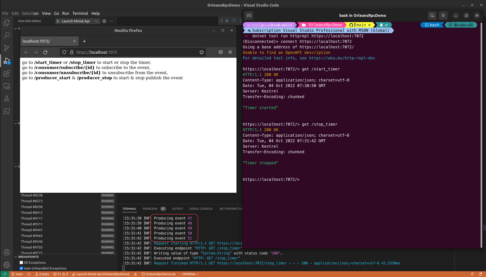

# Microsoft Orleans Silo Server projects

This folder contains the projects that implement various Orleans servers, to run these projects, you need to install [Visual Studio Code](https://code.visualstudio.com/#alt-downloads) & [.NET 6 SDK](https://aka.ms/DotNET_SDKs).

## Rpc.Demo.Hosting.BlazorServer

Demo project for using state-ful Microsoft Orleans Grain on Blazor Server project.

1. Using Visual Studio Code's *Run and Debug* feature, select **Launch BlazorServer** configuration then hit "Start Debugging(F5).
2. Go to Counter section in pop-up browser window to see the counter that backend supported by a Counter Grain.

## Rpc.Demo.Hosting.MinimalApi

Demonstrate Orleans event (Observer) pattern.

1. Restore local cli tool via `dotnet tool restore` command to install ["**httprepl**"](https://aka.ms/http-repl-doc), command line tool for testing HTTP APIs. 
2. Run the project via Visual Studio Code's *Run and Debug* feature, select **Launch Minimal Api** configuration then hit "Start Debugging(F5).
3. Open a terminal that working directory set to this git repository, run `dotnet tool run httprepl https://localhost:5000` to start the httprepl tool.
4. Verify each API endpoint by running `get` command, e.g. `get /start_timer` to start a timer, `get /stop_timer` to stop the timer, watch the Visual Studio Code Terminal or DEBUG CONSOLE that the running server displays.  
All Usable HTTP GET endpoint are list in pop-up web page when you run the project.

When you are done, exit the httprepl tool by typing `exit`, and stop the server by pressing Ctrl+C in the Visual Studio Code Terminal.